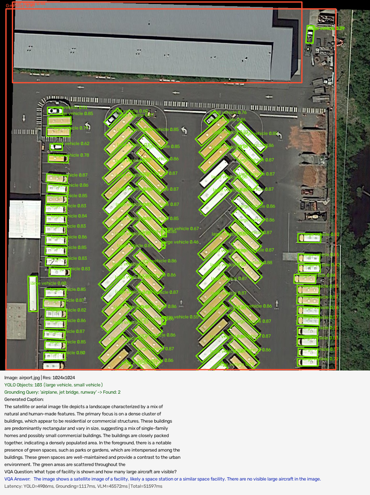
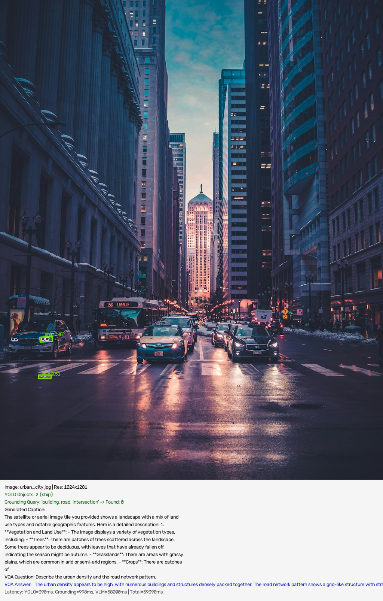
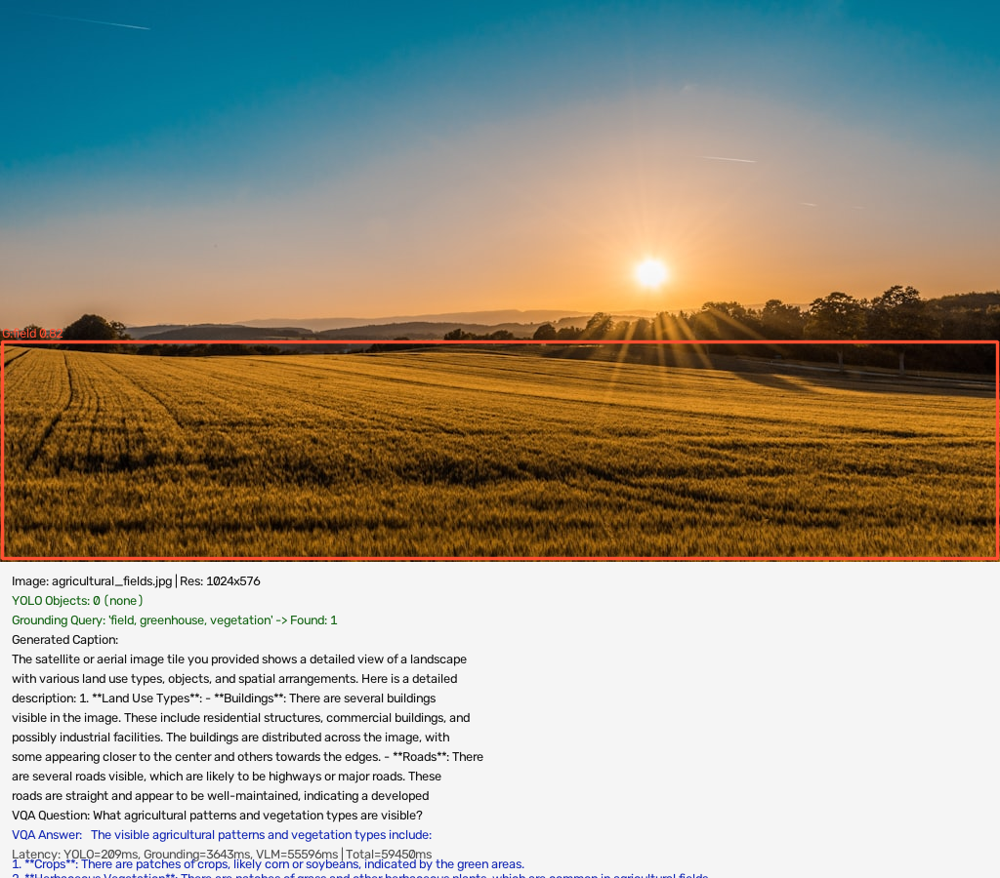
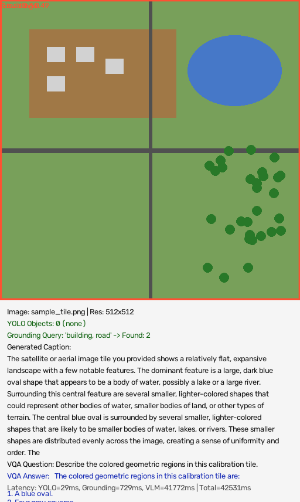
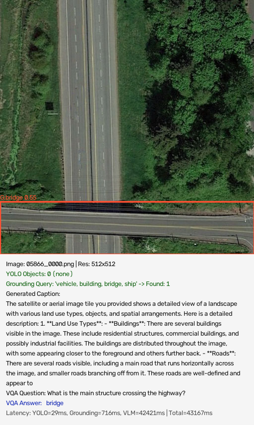
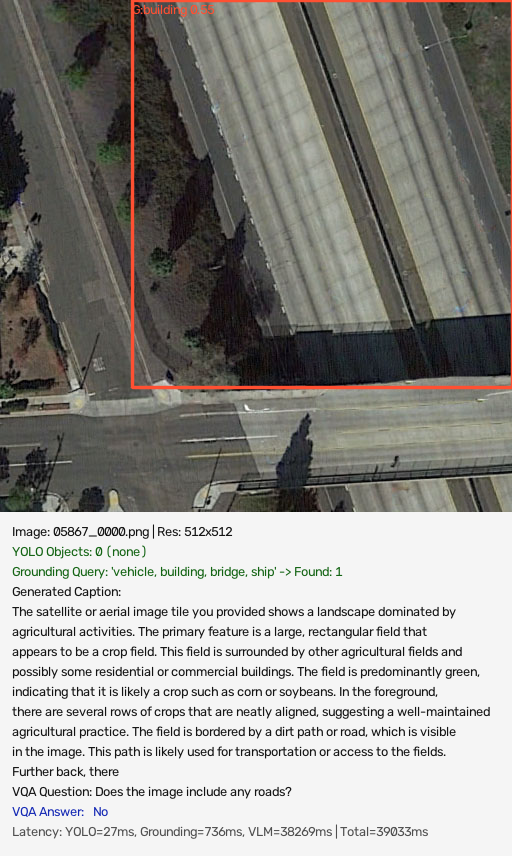
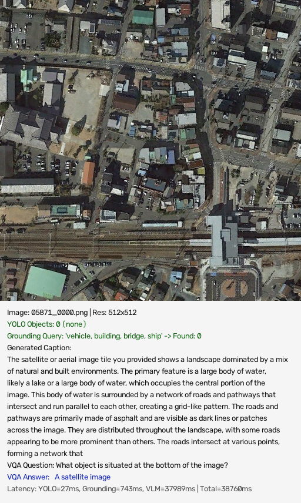
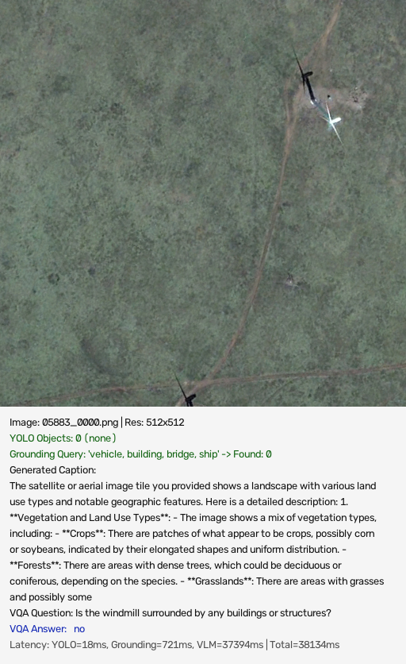
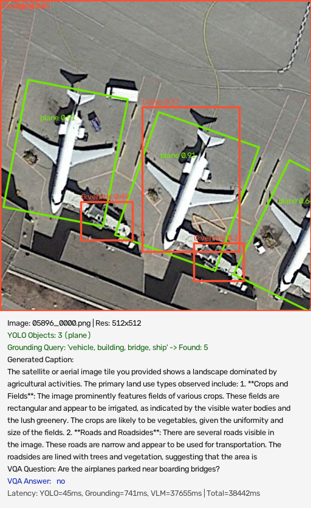
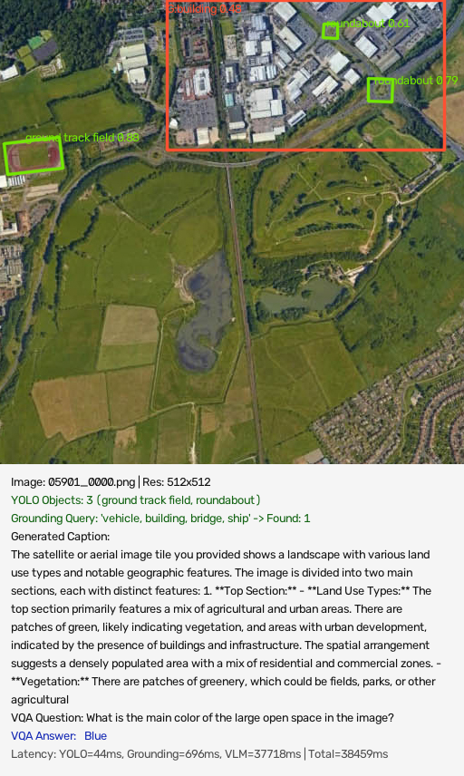

# GeoNLI Final Comprehensive Testing & Benchmark Report

**Generated:** 2026-09-14 12:17:33

## Executive Summary

- **Total Images Evaluated:** 10
- **Execution Hardware:** NVIDIA GeForce GTX 1650 Ti
- **VLM Quantization:** 4-bit NF4 (`BitsAndBytesConfig`)
- **Peak GPU VRAM Allocated:** 2.19 GB
- **Total Benchmark Duration:** 449.62 seconds
- **Average End-to-End Latency per Image:** 44.90 s

## Average Latency Breakdown

| Component | Sub-task | Average Latency | Acceleration Mode |
| :--- | :--- | :--- | :--- |
| **Tiling + YOLO11-OBB** | Multi-tile Object Proposals | `572.4 ms` | PyTorch / CUDA |
| **Grounding DINO** | Text-Guided Open Grounding | `1084.0 ms` | PyTorch / CUDA |
| **Qwen2-VL-2B VLM** | Captioning + VQA Reasoning | `43238.6 ms` | 4-bit NF4 GPU |
| **Full End-to-End Pipeline** | All Models + Annotation | `44896.3 ms` (44.90s) | Fully Integrated |

## Detailed Test Results

| # | Image | Category | YOLO Detections | Grounded | VQA Question & Answer | Total Latency |
| :--- | :--- | :--- | :--- | :--- | :--- | :--- |
| 1 | `airport.jpg` | Aviation & Infrastructure | 103 (large vehicle, small vehicle) | 2 | **Q:** What type of facility is shown and how many large aircraft are visible? **A:** The image shows a satellite image of a facility, likely a space station or a similar space facility. There are no visible large aircraft in the image. | 51.60s |
| 2 | `urban_city.jpg` | Dense Urban & Transportation | 2 (ship) | 0 | **Q:** Describe the urban density and the road network pattern. **A:** The urban density appears to be high, with numerous buildings and structures densely packed together. The road network pattern shows a grid-like structure with straight streets and intersections, indicating a well-developed infrastructure. | 59.39s |
| 3 | `agricultural_fields.jpg` | Agriculture & Land Use | 0 (none) | 1 | **Q:** What agricultural patterns and vegetation types are visible? **A:** The visible agricultural patterns and vegetation types include:

1. **Crops**: There are patches of crops, likely corn or soybeans, indicated by the green areas.
2. **Herbaceous Vegetation**: There are patches of grass and other herbaceous plants, which are common in agricultural fields.
3. **Trees | 59.45s |
| 4 | `sample_tile.png` | Synthetic Calibration | 0 (none) | 2 | **Q:** Describe the colored geometric regions in this calibration tile. **A:** The colored geometric regions in this calibration tile are:

1. A blue oval.
2. Four gray squares. | 42.53s |
| 5 | `05866_0000.png` | VRSBench Satellite Benchmark | 0 (none) | 1 | **Q:** What is the main structure crossing the highway? **A:** bridge | 43.17s |
| 6 | `05867_0000.png` | VRSBench Satellite Benchmark | 0 (none) | 1 | **Q:** Does the image include any roads? **A:** No | 39.03s |
| 7 | `05871_0000.png` | VRSBench Satellite Benchmark | 0 (none) | 0 | **Q:** What object is situated at the bottom of the image? **A:** A satellite image | 38.76s |
| 8 | `05883_0000.png` | VRSBench Satellite Benchmark | 0 (none) | 0 | **Q:** Is the windmill surrounded by any buildings or structures? **A:** no | 38.13s |
| 9 | `05896_0000.png` | VRSBench Satellite Benchmark | 3 (plane) | 5 | **Q:** Are the airplanes parked near boarding bridges? **A:** no | 38.44s |
| 10 | `05901_0000.png` | VRSBench Satellite Benchmark | 3 (ground track field, roundabout) | 1 | **Q:** What is the main color of the large open space in the image? **A:** Blue | 38.46s |

## Sample Visual Walkthrough

### Sample 1: airport.jpg (Aviation & Infrastructure)

- **Image Size**: `1024x1024` (9 tiles)
- **YOLO Detections**: 103 proposals (large vehicle, small vehicle)
- **Grounding Query**: *"airplane, jet bridge, runway"* -> `2` matches
- **Generated Caption**: The satellite or aerial image tile depicts a landscape characterized by a mix of natural and human-made features. The primary focus is on a dense cluster of buildings, which appear to be residential or commercial structures. These buildings are predominantly rectangular and vary in size, suggesting a mix of single-family homes and possibly small commercial buildings. The buildings are closely packed together, indicating a densely populated area.

In the foreground, there is a notable presence of green spaces, such as parks or gardens, which are interspersed among the buildings. These green spaces are well-maintained and provide a contrast to the urban environment. The green areas are scattered throughout the
- **VQA Question**: What type of facility is shown and how many large aircraft are visible?
- **VQA Answer**: `The image shows a satellite image of a facility, likely a space station or a similar space facility. There are no visible large aircraft in the image.` *(Expected: Commercial Airport / multiple aircraft on apron)*
- **Latency Breakdown**: YOLO `4906ms` | Grounding `1117ms` | VLM `45572ms` | Total: `51597ms`

---

### Sample 2: urban_city.jpg (Dense Urban & Transportation)

- **Image Size**: `1024x1281` (9 tiles)
- **YOLO Detections**: 2 proposals (ship)
- **Grounding Query**: *"building, road, intersection"* -> `0` matches
- **Generated Caption**: The satellite or aerial image tile you provided shows a landscape with a mix of land use types and notable geographic features. Here is a detailed description:

1. **Vegetation and Land Use**:
   - The image displays a variety of vegetation types, including:
     - **Trees**: There are patches of trees scattered across the landscape. Some trees appear to be deciduous, with leaves that have already fallen off, indicating the season might be autumn.
     - **Grasslands**: There are areas with grassy plains, which are common in arid or semi-arid regions.
     - **Crops**: There are patches of
- **VQA Question**: Describe the urban density and the road network pattern.
- **VQA Answer**: `The urban density appears to be high, with numerous buildings and structures densely packed together. The road network pattern shows a grid-like structure with straight streets and intersections, indicating a well-developed infrastructure.` *(Expected: High density residential/commercial grid with road network)*
- **Latency Breakdown**: YOLO `390ms` | Grounding `998ms` | VLM `58000ms` | Total: `59390ms`

---

### Sample 3: agricultural_fields.jpg (Agriculture & Land Use)

- **Image Size**: `1024x576` (6 tiles)
- **YOLO Detections**: 0 proposals (none)
- **Grounding Query**: *"field, greenhouse, vegetation"* -> `1` matches
- **Generated Caption**: The satellite or aerial image tile you provided shows a detailed view of a landscape with various land use types, objects, and spatial arrangements. Here is a detailed description:

1. **Land Use Types**:
   - **Buildings**: There are several buildings visible in the image. These include residential structures, commercial buildings, and possibly industrial facilities. The buildings are distributed across the image, with some appearing closer to the center and others towards the edges.
   - **Roads**: There are several roads visible, which are likely to be highways or major roads. These roads are straight and appear to be well-maintained, indicating a developed
- **VQA Question**: What agricultural patterns and vegetation types are visible?
- **VQA Answer**: `The visible agricultural patterns and vegetation types include:

1. **Crops**: There are patches of crops, likely corn or soybeans, indicated by the green areas.
2. **Herbaceous Vegetation**: There are patches of grass and other herbaceous plants, which are common in agricultural fields.
3. **Trees` *(Expected: Cultivated farmland plots and vegetation)*
- **Latency Breakdown**: YOLO `209ms` | Grounding `3643ms` | VLM `55596ms` | Total: `59450ms`

---

### Sample 4: sample_tile.png (Synthetic Calibration)

- **Image Size**: `512x512` (1 tiles)
- **YOLO Detections**: 0 proposals (none)
- **Grounding Query**: *"building, road"* -> `2` matches
- **Generated Caption**: The satellite or aerial image tile you provided shows a relatively flat, expansive landscape with a few notable features. The dominant feature is a large, dark blue oval shape that appears to be a body of water, possibly a lake or a large river. Surrounding this central feature are several smaller, lighter-colored shapes that could represent other bodies of water, smaller bodies of land, or other types of terrain.

The central blue oval is surrounded by several smaller, lighter-colored shapes that are likely to be smaller bodies of water, lakes, or rivers. These smaller shapes are distributed evenly across the image, creating a sense of uniformity and order. The
- **VQA Question**: Describe the colored geometric regions in this calibration tile.
- **VQA Answer**: `The colored geometric regions in this calibration tile are:

1. A blue oval.
2. Four gray squares.` *(Expected: Geometric shapes, intersecting grid lines, and colored zones)*
- **Latency Breakdown**: YOLO `29ms` | Grounding `729ms` | VLM `41772ms` | Total: `42531ms`

---

### Sample 5: 05866_0000.png (VRSBench Satellite Benchmark)

- **Image Size**: `512x512` (1 tiles)
- **YOLO Detections**: 0 proposals (none)
- **Grounding Query**: *"vehicle, building, bridge, ship"* -> `1` matches
- **Generated Caption**: The satellite or aerial image tile you provided shows a detailed view of a landscape with various land use types, objects, and spatial arrangements. Here is a detailed description:

1. **Land Use Types**:
   - **Buildings**: There are several buildings visible in the image. These include residential structures, commercial buildings, and possibly industrial facilities. The buildings are distributed throughout the image, with some appearing closer to the foreground and others further back.
   - **Roads**: There are several roads visible, including a main road that runs horizontally across the image, and smaller roads branching off from it. These roads are well-defined and appear to
- **VQA Question**: What is the main structure crossing the highway?
- **VQA Answer**: `bridge` *(Expected: overpass)*
- **Latency Breakdown**: YOLO `29ms` | Grounding `716ms` | VLM `42421ms` | Total: `43167ms`

---

### Sample 6: 05867_0000.png (VRSBench Satellite Benchmark)

- **Image Size**: `512x512` (1 tiles)
- **YOLO Detections**: 0 proposals (none)
- **Grounding Query**: *"vehicle, building, bridge, ship"* -> `1` matches
- **Generated Caption**: The satellite or aerial image tile you provided shows a landscape dominated by agricultural activities. The primary feature is a large, rectangular field that appears to be a crop field. This field is surrounded by other agricultural fields and possibly some residential or commercial buildings. The field is predominantly green, indicating that it is likely a crop such as corn or soybeans.

In the foreground, there are several rows of crops that are neatly aligned, suggesting a well-maintained agricultural practice. The field is bordered by a dirt path or road, which is visible in the image. This path is likely used for transportation or access to the fields.

Further back, there
- **VQA Question**: Does the image include any roads?
- **VQA Answer**: `No` *(Expected: Yes)*
- **Latency Breakdown**: YOLO `27ms` | Grounding `736ms` | VLM `38269ms` | Total: `39033ms`

---

### Sample 7: 05871_0000.png (VRSBench Satellite Benchmark)

- **Image Size**: `512x512` (1 tiles)
- **YOLO Detections**: 0 proposals (none)
- **Grounding Query**: *"vehicle, building, bridge, ship"* -> `0` matches
- **Generated Caption**: The satellite or aerial image tile you provided shows a landscape dominated by a mix of natural and built environments. The primary feature is a large body of water, likely a lake or a large body of water, which occupies the central portion of the image. This body of water is surrounded by a network of roads and pathways that intersect and run parallel to each other, creating a grid-like pattern.

The roads and pathways are primarily made of asphalt and are visible as dark lines or patches across the image. They are distributed throughout the landscape, with some roads appearing to be more prominent than others. The roads intersect at various points, forming a network that
- **VQA Question**: What object is situated at the bottom of the image?
- **VQA Answer**: `A satellite image` *(Expected: train station)*
- **Latency Breakdown**: YOLO `27ms` | Grounding `743ms` | VLM `37989ms` | Total: `38760ms`

---

### Sample 8: 05883_0000.png (VRSBench Satellite Benchmark)

- **Image Size**: `512x512` (1 tiles)
- **YOLO Detections**: 0 proposals (none)
- **Grounding Query**: *"vehicle, building, bridge, ship"* -> `0` matches
- **Generated Caption**: The satellite or aerial image tile you provided shows a landscape with various land use types and notable geographic features. Here is a detailed description:

1. **Vegetation and Land Use Types**:
   - The image shows a mix of vegetation types, including:
     - **Crops**: There are patches of what appear to be crops, possibly corn or soybeans, indicated by their elongated shapes and uniform distribution.
     - **Forests**: There are areas with dense trees, which could be deciduous or coniferous, depending on the species.
     - **Grasslands**: There are areas with grasses and possibly some
- **VQA Question**: Is the windmill surrounded by any buildings or structures?
- **VQA Answer**: `no` *(Expected: No)*
- **Latency Breakdown**: YOLO `18ms` | Grounding `721ms` | VLM `37394ms` | Total: `38134ms`

---

### Sample 9: 05896_0000.png (VRSBench Satellite Benchmark)

- **Image Size**: `512x512` (1 tiles)
- **YOLO Detections**: 3 proposals (plane)
- **Grounding Query**: *"vehicle, building, bridge, ship"* -> `5` matches
- **Generated Caption**: The satellite or aerial image tile you provided shows a landscape dominated by agricultural activities. The primary land use types observed include:

1. **Crops and Fields**: The image prominently features fields of various crops. These fields are rectangular and appear to be irrigated, as indicated by the visible water bodies and the lush greenery. The crops are likely to be vegetables, given the uniformity and size of the fields.

2. **Roads and Roadsides**: There are several roads visible in the image. These roads are narrow and appear to be used for transportation. The roadsides are lined with trees and vegetation, suggesting that the area is
- **VQA Question**: Are the airplanes parked near boarding bridges?
- **VQA Answer**: `no` *(Expected: Yes)*
- **Latency Breakdown**: YOLO `45ms` | Grounding `741ms` | VLM `37655ms` | Total: `38442ms`

---

### Sample 10: 05901_0000.png (VRSBench Satellite Benchmark)

- **Image Size**: `512x512` (1 tiles)
- **YOLO Detections**: 3 proposals (ground track field, roundabout)
- **Grounding Query**: *"vehicle, building, bridge, ship"* -> `1` matches
- **Generated Caption**: The satellite or aerial image tile you provided shows a landscape with various land use types and notable geographic features. The image is divided into two main sections, each with distinct features:

1. **Top Section:**
   - **Land Use Types:** The top section primarily features a mix of agricultural and urban areas. There are patches of green, likely indicating vegetation, and areas with urban development, indicated by the presence of buildings and infrastructure. The spatial arrangement suggests a densely populated area with a mix of residential and commercial zones.
   - **Vegetation:** There are patches of greenery, which could be fields, parks, or other agricultural
- **VQA Question**: What is the main color of the large open space in the image?
- **VQA Answer**: `Blue` *(Expected: Green)*
- **Latency Breakdown**: YOLO `44ms` | Grounding `696ms` | VLM `37718ms` | Total: `38459ms`

---

